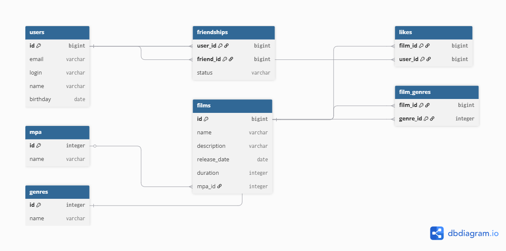

# java-filmorate

Template repository for Filmorate project.

# Filmorate

## Схема базы данных



## Описание базы данных

### Таблица users

Хранит информацию о пользователях приложения.

Поля:

- id
- email
- login
- name
- birthday

---

### Таблица films

Хранит информацию о фильмах.

Поля:

- id
- name
- description
- release_date
- duration
- mpa_id

---

### Таблица mpa

Справочник возрастных рейтингов.

- G
- PG
- PG-13
- R
- NC-17

---

### Таблица film_genres

Связующая таблица между фильмами и жанрами.

Поля:

- film_id
- genre_id

### Таблица likes

Хранит информацию о лайках пользователей.

Поля:

- film_id
- user_id

#### Таблица friendships

Хранит информацию о друзьях пользователей.

Поля:

- user_id
- friend_id
- status
- ## Основные запросы
-

### Получить фильм

```sql
#SELECT *
FROM films
WHERE id = ?;
```

### Получить рейтинг

SELECT *
FROM mpa
WHERE id = ?;

```
### Получить жанры фильма
```sql
SELECT *
FROM genres
ORDER BY id;
```

### Получить ТОП-10 популярных фильмов

```sql
SELECT f.*,
COUNT(l.user_id) AS likes
FROM films f
LEFT JOIN likes l
ON f.id = l.film_id
GROUP BY f.id
ORDER BY likes DESC
LIMIT 10;
```

### Получить друзей пользователя

```sql
SELECT u.*
FROM users u
JOIN friendships fr
ON u.id = fr.friend_id
WHERE fr.user_id = ?;
```

